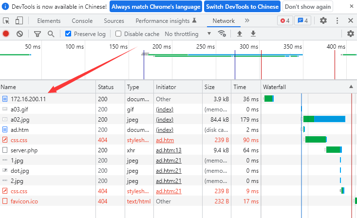
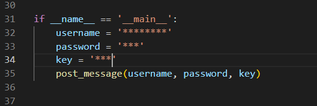
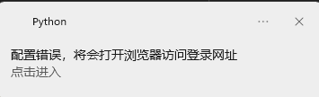
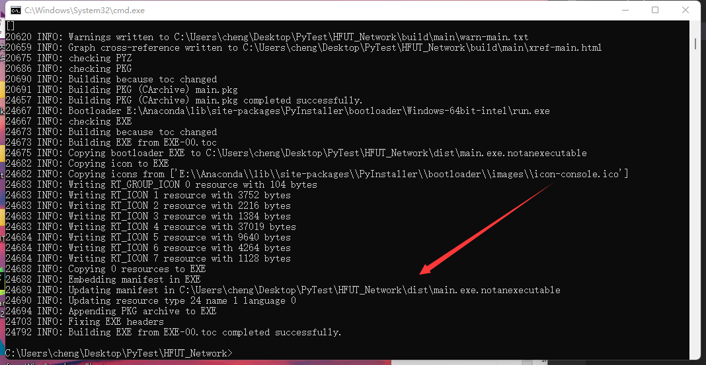

# HFUT校园网自动登录

-------------
### 使用方法
- 抓包

[校园网登录页面](http://172.16.200.11/)，打开Chrome进入开发者工具，点击Network。

</p>
<div align='center'>
     
</div>

点击Name下的 172.16.200.11 在右侧打开的页面中点击 Payload 得到表单的内容。


- 修改python文件

进入[main.py](main.py)，修改如下配置：

</p>
<div align='center'>
     
</div>

完成修改后，点击运行可以测试是否成功。

成功的提醒如下图所示：

</p>
<div align='center'>
     
</div>

不成功会提示所填内容错误，点击后进入页面登录：

</p>
<div align='center'>
     
</div>

### 生成exe可执行文件

1、进入cmd界面，输入以下指令：

```
pip install pyinstaller
```

2、安装成功会提示：
```
Successfully installed pyinstaller-3.3.1
```

3、进入python程序文件夹，打包程序:
```
pyinstaller -F E:\main.py
```

生成的exe文件位置在输出的后面可以看到:

</p>
<div align='center'>
     
</div>

### 设置开机自启

cmd输入指令:
```
shell:startup
```

将exe文件发送桌面快捷方式，并将快捷方式移动到打开的文件夹中。
